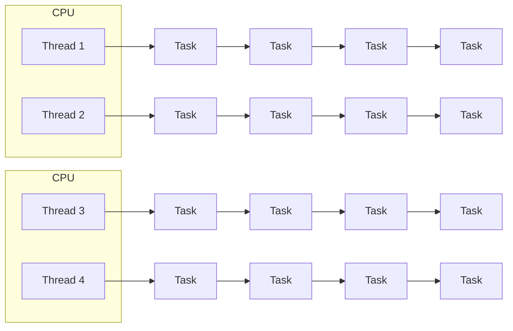

---
#### ThreadPoolExecutor
- 병렬성으로 처리 성능을 극대화하고 동시성으로 cpu 자원을 효율적으로 운용
- 여러 개의 작업을 처리



#### ForkJoinPool
- 하나의  태스크를 서브 태스크로 분할하여 병렬처리함으로써 전체 작성 성능 높임
![[Pasted image 20250918173900.png]]
---
# Java Thread
- 시스템 콜을 통해서 커널에서 생성된 kernel Thread와 일대일로 매핑되어 최종적으로 커널에서 관리됨
- JVM에서 스레드를 생성할 때마다 커널에서 자바 스레드와 대응하는 커널 스레드 생성

### Thread 구조(메서드)
- 스레드 시작
- 스레드 실행 영역 : 스레드의 실행 메서드는 예외를 던질 수 없음
- 수행중인 스레드 객체 반환
- 활성화 돼있는 스레드 수 반환 
....

### Thread 생성
**Thread 상속**
컴파일 타임에 실행코드가 결정되어 동적인 변경이 불가능
```java
public class Test extends Thread{
	
	@Override
	public void run(){
	
	}
}
Thread thread = new Test();
thread.start()
```

**Runnable 인터페이스 구현**
작업내용을 Runnable에 의해 정의해서 스레드에 전달하면 스레드는 Runnable을 실행
	- 유연하고 확장가능함
```java
public class Test implements Runnable{
	
	@Override
	public void run(){
	
	}
}
Test test = new Test();
Thread thread = new Thread(task);
thread.start()
```

**기타 방법**
- Runnable 익명 클래스
	```java
	new Thread(new Runnable(){
		@Override
		public void run(){
		}
	})
	```
- 람다 사용
```java
new Thread(() -> {
	//내용
}).start()
```

## 1. Thread 실행/종료
- OS 스케줄러에 의해 실행 순서가 결정되며 JVM에서 제어 불가
- 새로운 스레드는 현재 스레드와 독립적으로 실행, 최대 한 번 시작 가능하고 스레드가 종료된 후 다시 시작 불가능

### 1.1 실행
#### start()
- 스레드를 실행시키는 메서드로 시스템 콜을 통해서 커널 스레드 생성 요청

**Thread 생성 과정**
1. 메인 스레드가 새로운 스레드를 생성
2. start를 호출해서 실행 시작
3. 내부적으로 네이티브 메서드를 호출해서 커널 스레드를 생성하도록 시스템 콜
4. 커널 스레드와 자바 스레드가 일대일 매핑
5. 커널 스레드는 os 스케쥴러로 부터 cpu 할당을 받기 까지 실행 대기 상태
6. 커널 스레드가 스케쥴러에 의해 실행상태가 되면 jvm에 매핑 된 자바 스레드의 run 메서드 호출

#### run()
- 스레드가 실행(start) 되면 해당 스레드에 의해 자동으로 호출되는 메서드
>[!Caution]
> run 메서드를 직접 호출 -> 새로운 스레드가 생성 x, 직접 호출한 스레드의 실행 스택에서 run이 실행

### 1.2 Thread Stack
- 스레드가 생성되면, 해당 스레드를 위한 스택이 같이 만들어짐
- 스택은 각 스레드마다 독립적으로 할당 -> 스레드간 접근하거나 공유할 수 없음

**stack 구성**
- 프레임(Frame)으로 구성
- 새 메서드를 호출할 때마다 로컬 변수 및 객체 참조 변수와 함께 스택의 맨위에 생성
- 실행 완료 후 스택 프레임 제거 

**stack 메모리 상태 관리**
- 스택 내부의 변수는 메서드가 실행되는 동안에만 존재
- 힙과 비교할 때 접근이 빠름

### 1.3 Thread 종료
- run 메서드가 모두 실행되면 스레드는 자동 종료
- 예외가 발생할 경우 종료, 다른 스레드에 영향을 미치지 않음

**싱글스레드**
- main 스레드만 종료되면 앱이 종료

**멀티스레드**
- jvm에서 실행하고 있는 모든 스레드가 종료되어야 어플리케이션이 종료(데몬 스레드 제외)
- 스레드 종료 시점은 os에서 결정하므로 매번 다르게 나올 수 있음

---
## 2. Thread 생명주기, 상태
- JVM에는 6가지 스레드 상태가 존재하고 오직 하나의 상태를 갖음
- 'getState()' 메서드를 사용하여 가져올 수 있음.
- 상태에 대한 ENUM을 정의함

| 상태             | ENUM          | 설명                                               |
| -------------- | ------------- | ------------------------------------------------ |
| 객체 생성          | NEW           | 스레드 객체가 생성됨, 아직 시작되지 않은 스레드 상태                   |
| 실행 대기          | RUNNABLE      | 실행 중이거나 실행 가능한 스레드 상태                            |
| 일시 정지          | WAITING       | ==대기 중인 스레드 상태==로서 다른 스레드가 특정 작업을 수행하기를 기다림      |
| 일시 정지          | TIMED_WAITING | ==대기 시간이 지정된 스레드 상태==로서 다른 스레드가 특정 작업을 수행하기를 기다림 |
| 일시 정지          | BLOCKED       | ==모니터 락(Lock)이 해제될 때까지 기다리며== 차단된 스레드 상태         |
| 종료          '' | TERMINATED    | 실행이 완료된 스레드 상태                                   |

---
## 3. Thread API
### 3.1 sleep
- 지정된 시간 동안 현재 스레드의 실행을 ==일시 정지==하고 대기 상태로 빠졌다가 시간이 지나면 ==실행 대기 상태==로 전환

#### 동작 원리
- 네이티브 메서드로 구현되어 시스템 콜을 통해 작동
- 유저모드 → 커널모드 → 유저모드 전환 과정을 거침

#### InterruptedException 처리
sleep 중인 스레드가 인터럽트되면:
- `InterruptedException` 예외 발생
- 스레드는 수면 상태에서 즉시 깨어남
- 실행 대기 상태로 전환되어 CPU 할당 대기
#### sleep(0)과 sleep(n)의 의미
##### sleep(0)
- **목적**: 동일한 우선순위의 다른 스레드에게 실행 기회 양보
- **동작**:
    - 커널모드로 전환
    - 동일한 우선순위의 대기 중인 스레드가 있으면 → 컨텍스트 스위칭 발생
    - 없으면 → 현재 스레드가 계속 실행 (모드 전환만 발생)
##### sleep(n) (n > 0)
- **목적**: 명확한 시간 동안 스레드 실행 정지
- **동작**:
    - 커널모드로 전환 후 무조건 현재 스레드를 대기 상태로 전환
    - 다른 스레드에게 CPU 할당
    - 모드 전환 + 컨텍스트 스위칭 모두 발생

> 💡 **권장사항**: 다른 스레드에게 명확히 실행을 양보하려면 `sleep(1)`을 사용하세요.

#### 특징
##### 동기화 메서드에서의 동작
- sleep 중인 스레드는 **획득한 모니터나 락을 유지**합니다
- 락을 해제하지 않으므로 다른 스레드가 동기화 블록에 접근할 수 없음
##### 인터럽트 처리
- sleep 중 인터럽트 발생 시 즉시 대기 해제
- 실행 상태로 전환되어 예외 처리 수행
