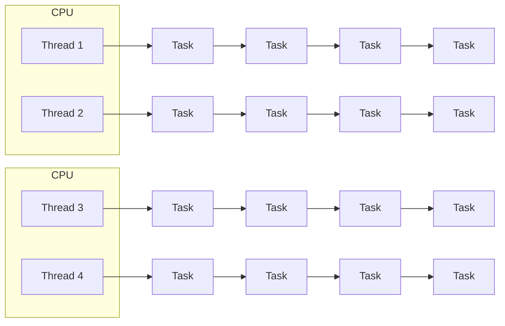

---
#### ThreadPoolExecutor
- 병렬성으로 처리 성능을 극대화하고 동시성으로 cpu 자원을 효율적으로 운용
- 여러 개의 작업을 처리



#### ForkJoinPool
- 하나의  태스크를 서브 태스크로 분할하여 병렬처리함으로써 전체 작성 성능 높임
![[Pasted image 20250918173900.png]]
---
# Java Thread
- 시스템 콜을 통해서 커널에서 생성된 kernel Thread와 일대일로 매핑되어 최종적으로 커널에서 관리됨
- JVM에서 스레드를 생성할 때마다 커널에서 자바 스레드와 대응하는 커널 스레드 생성

### Thread 구조(메서드)
- 스레드 시작
- 스레드 실행 영역 : 스레드의 실행 메서드는 예외를 던질 수 없음
- 수행중인 스레드 객체 반환
- 활성화 돼있는 스레드 수 반환 
....

### Thread 생성
**Thread 상속**
컴파일 타임에 실행코드가 결정되어 동적인 변경이 불가능
```java
public class Test extends Thread{
	
	@Override
	public void run(){
	
	}
}
Thread thread = new Test();
thread.start()
```

**Runnable 인터페이스 구현**
작업내용을 Runnable에 의해 정의해서 스레드에 전달하면 스레드는 Runnable을 실행
	- 유연하고 확장가능함
```java
public class Test implements Runnable{
	
	@Override
	public void run(){
	
	}
}
Test test = new Test();
Thread thread = new Thread(task);
thread.start()
```

**기타 방법**
- Runnable 익명 클래스
	```java
	new Thread(new Runnable(){
		@Override
		public void run(){
		}
	})
	```
- 람다 사용
```java
new Thread(() -> {
	//내용
}).start()
```

## 1. Thread 실행/종료
- OS 스케줄러에 의해 실행 순서가 결정되며 JVM에서 제어 불가
- 새로운 스레드는 현재 스레드와 독립적으로 실행, 최대 한 번 시작 가능하고 스레드가 종료된 후 다시 시작 불가능

### 1.1 실행
#### start()
- 스레드를 실행시키는 메서드로 시스템 콜을 통해서 커널 스레드 생성 요청

**Thread 생성 과정**
1. 메인 스레드가 새로운 스레드를 생성
2. start를 호출해서 실행 시작
3. 내부적으로 네이티브 메서드를 호출해서 커널 스레드를 생성하도록 시스템 콜
4. 커널 스레드와 자바 스레드가 일대일 매핑
5. 커널 스레드는 os 스케쥴러로 부터 cpu 할당을 받기 까지 실행 대기 상태
6. 커널 스레드가 스케쥴러에 의해 실행상태가 되면 jvm에 매핑 된 자바 스레드의 run 메서드 호출

#### run()
- 스레드가 실행(start) 되면 해당 스레드에 의해 자동으로 호출되는 메서드
>[!Caution]
> run 메서드를 직접 호출 -> 새로운 스레드가 생성 x, 직접 호출한 스레드의 실행 스택에서 run이 실행

### 1.2 Thread Stack
- 스레드가 생성되면, 해당 스레드를 위한 스택이 같이 만들어짐
- 스택은 각 스레드마다 독립적으로 할당 -> 스레드간 접근하거나 공유할 수 없음

**stack 구성**
- 프레임(Frame)으로 구성
- 새 메서드를 호출할 때마다 로컬 변수 및 객체 참조 변수와 함께 스택의 맨위에 생성
- 실행 완료 후 스택 프레임 제거 

**stack 메모리 상태 관리**
- 스택 내부의 변수는 메서드가 실행되는 동안에만 존재
- 힙과 비교할 때 접근이 빠름

### 1.3 Thread 종료
- run 메서드가 모두 실행되면 스레드는 자동 종료
- 예외가 발생할 경우 종료, 다른 스레드에 영향을 미치지 않음

**싱글스레드**
- main 스레드만 종료되면 앱이 종료

**멀티스레드**
- jvm에서 실행하고 있는 모든 스레드가 종료되어야 어플리케이션이 종료(데몬 스레드 제외)
- 스레드 종료 시점은 os에서 결정하므로 매번 다르게 나올 수 있음

---
## 2. Thread 생명주기, 상태
- JVM에는 6가지 스레드 상태가 존재하고 오직 하나의 상태를 갖음
- 'getState()' 메서드를 사용하여 가져올 수 있음.
- 상태에 대한 ENUM을 정의함

| 상태             | ENUM          | 설명                                               |
| -------------- | ------------- | ------------------------------------------------ |
| 객체 생성          | NEW           | 스레드 객체가 생성됨, 아직 시작되지 않은 스레드 상태                   |
| 실행 대기          | RUNNABLE      | 실행 중이거나 실행 가능한 스레드 상태                            |
| 일시 정지          | WAITING       | ==대기 중인 스레드 상태==로서 다른 스레드가 특정 작업을 수행하기를 기다림      |
| 일시 정지          | TIMED_WAITING | ==대기 시간이 지정된 스레드 상태==로서 다른 스레드가 특정 작업을 수행하기를 기다림 |
| 일시 정지          | BLOCKED       | ==모니터 락(Lock)이 해제될 때까지 기다리며== 차단된 스레드 상태         |
| 종료          '' | TERMINATED    | 실행이 완료된 스레드 상태                                   |

---
## 3. Thread API
### 3.1 sleep
- 지정된 시간 동안 현재 스레드의 실행을 ==일시 정지==하고 대기 상태로 빠졌다가 시간이 지나면 ==실행 대기 상태==로 전환

#### 동작 원리
- 네이티브 메서드로 구현되어 시스템 콜을 통해 작동
- 유저모드 → 커널모드 → 유저모드 전환 과정을 거침

#### InterruptedException 처리
sleep 중인 스레드가 인터럽트되면:
- `InterruptedException` 예외 발생
- 스레드는 수면 상태에서 즉시 깨어남
- 실행 대기 상태로 전환되어 CPU 할당 대기
#### sleep(0)과 sleep(n)의 의미
##### sleep(0)
- **목적**: 동일한 우선순위의 다른 스레드에게 실행 기회 양보
- **동작**:
    - 커널모드로 전환
    - 동일한 우선순위의 대기 중인 스레드가 있으면 → 컨텍스트 스위칭 발생
    - 없으면 → 현재 스레드가 계속 실행 (모드 전환만 발생)
##### sleep(n) (n > 0)
- **목적**: 명확한 시간 동안 스레드 실행 정지
- **동작**:
    - 커널모드로 전환 후 무조건 현재 스레드를 대기 상태로 전환
    - 다른 스레드에게 CPU 할당
    - 모드 전환 + 컨텍스트 스위칭 모두 발생

> 💡 **권장사항**: 다른 스레드에게 명확히 실행을 양보하려면 `sleep(1)`을 사용하세요.

#### 특징
##### 동기화 메서드에서의 동작
- sleep 중인 스레드는 **획득한 모니터나 락을 유지**합니다
- 락을 해제하지 않으므로 다른 스레드가 동기화 블록에 접근할 수 없음
##### 인터럽트 처리
- sleep 중 인터럽트 발생 시 즉시 대기 해제
- 실행 상태로 전환되어 예외 처리 수행

### 3.2 join
- **join() 호출 시**: OS 스케줄러가 join()을 호출한 스레드를 **대기 상태**로 전환
- **CPU 할당**: 호출 대상 스레드가 CPU를 사용하도록 스케줄링
- **작업 완료 후**: 대상 스레드가 종료되면 호출한 스레드를 **실행 대기 상태**로 전환

#### 주요 사용 목적
- 스레드 실행 순서 제어
- 다른 스레드의 작업 완료 대기
- 순차적인 실행 흐름 구성

#### 내부 구현
- `Object`의 `wait()` 네이티브 메서드와 연결
- 시스템 콜을 통해 **커널 모드**에서 수행
- 내부적으로 `wait()` & `notify()` 메커니즘으로 제어

#### 예외 처리
- join()을 호출한 스레드가 **인터럽트**되면:
    - 대기 상태에서 해제
    - 실행 상태로 전환
    - `InterruptedException` 발생

```java
Runnable r = new MyRunnable();
Thread t = new Trhead(r);
t.start();

try{
	t.join(); // main 스레드는 t의 작업이 종료될 때까지 일시정지함
}catch(InterruptedException e){
	
}
```


### 3.3 interrupt() & interrupted() & isInterrupted()
- 특정한 스레드에게 인터럽트 시그널을 줌으로써 스레드의 실행을 중단할 수 있다.

#### interrupt
- 스레드에게 인터럽트가 발생했다는 신호를 보냄
- 현재 실행흐름을 멈추고 인터럽트 이벤트를 먼저 처리하도록 함
-  인터럽트 상태(`interrupted status`)가 `true`로 바뀜

**interrupted 속성**
- 인터럽트 상태를 나타냄, 기본값 false
- 이 상태를 이용해서 스레드 중지, 작업 취소, 스레드 종료 등의 기능을 구현
- 한 스레드가 다른 스레드를 인터럽트 할 수 있고, 자기 자신을 인터럽트 할 수도 있음

#### 정적 메서드 interrupted()
 - 인터럽트의 상태를 반환함
 - 인터럽트 상태가 `true`인 경우 true를 반환하고, ==인터럽트 상태를 false로 초기화하고 인터럽트를 해제==
 - 주로 **반복문 안에서 인터럽트 확인 후 종료 로직**에 사용됨.

#### isInterrupted()
- 인터럽트의 상태를 반환
- ==상태를 변경하지는 않음==

#### InterruptedException
- 스레드가 블로킹 상태일 때(`sleep`, `wait`, `join`, `Future.get` 등) `interrupt()`를 호출하면 발생.
- 예외 발생 시, 인터럽트 상태는 자동으로 초기화(false)

### 3.4 name(), currentThread(), isAlive()
#### Thread Name
- 스레드에 이름을 지정하면 실행중인 스레드를  쉽게 찾을 수 있음
- 스레드를 생성하면 이름이 자동으로 주어짐
	- 메인 스레드 = 'main'
	- 나머지 = 'Thread - 0' ....
**이름 지정**
```java
//1. 객체 생성 시
Thread thread = new Thread(<group>,<runnable>, "thread1")
//2. set 메서드
thread.setName("thread")
```

#### currentThread(static)
- 현재 실행 중인 스레드 객체에 대한 참조를 반환

#### isAlive()
- 스레드가 살아 있는지 여부를 알 수 있음
- 스레드가 종료되지 않은 경우 활성 상태인 것으로 간주

### 3.5 Priority
- 자바는 고정 우선순위 ==선점형 스케쥴링(fixed-priority pre-emptive scheduling)==으로 알려진 매우 단순하고 결정적인 스케쥴링 알고리즘 지원
- 실행 대기 상태의 스레드 중에 상대적인 우선 순위에 따라 스레드 예약

#### 우선 순위
- 1 to 10 사이의 정수이며 정수 값이 높을 수록 우선순위가 높음
- 생성될 때, 우선순위 값이 정해지며 기본 우선 순위인 5로 설정
- 우선순위가 같을 경우 라운드 로빈 스케줄링 방식에 의해 다음 스레드 선택
- ==스케줄러가 반드시 우선순위가 높은 스레드를 실행하다고 보장할 수 없음.== 운영체제마다 다른 정책들이 있을 수 있으며, 기아 상태를 피하기 위해 스케쥴러는 우선순위가 낮은 스레드를 선택 가능

#### 우선순위 유형
- 최소 우선순위 - 1, MIN_PRIORITY
- 기본 우선순위 - 5, NORM_PRIORITY
- 최대 우선순위 - 10, MAX_PRIORITY

#### 우선순위 변경 및 확인
- void setPriority(int newPriority) : 
	- 1 ~ 10이외의 값을 설정하면 오류 발생
	- 스레드의 우선순위를 새롭게 변경
- int getPrority(): 스레드 우선순위 반환

---
## 4. Thread 활용

### 4.1 스레드 예외 처리(UncaughtExceptionHandler)
- run 메서드는 예외를 던질 수 없기 때문에 예외가 발생할 경우 run() 안에서만 예외를 처리해야함.
- RuntimeException 타입의 예외가 발생하면, 스레드 밖에서 예외를 캐치할 수 없고 사라짐
- 스레드가 비정상적으로 종료되었거나 특정한 예외를 외부에서 캐치하기 위해서 ==UncaughtExceptionHandler 인터페이스==를 제공함

#### UncaughtExceptionHandler
- 캐치되지 않는 예외에 의해 스레드가 갑자기 종료됐을 경우 호출되는 핸들러 인터페이스
- 어떤 원인으로 인해 스레드가 종료됐는지 대상 스레드와 예외를 파악할 수 있음

#### API
- **setDefaultUncaughtExceptionHandler** (static) : 
	- 모든 스레드에서 발생하는 uncaughtException을 처리하는 메서드
- **setUncaughtExceptionHandler(UncaughtExceptionHander handler)**:
	- 대상 스레드에서 발ㄹ생하는 uncaughtException을 처리하는 인스턴스 메서드
	- setDefaultUnacughtExceptionHandler보다 우선순위가 높음

```java
Thread handler = (t, e) -> {
	System.out.println("....")
}
Thread t = new Thread(...);
t.setUncaughtExceptionHandler(handler);
```

### 4.2 사용자 스레드 vs 데몬 스레드
- 자바의 스레드는 `사용자 스레드`와 `데몬 스레드`로 구분할 수 있음
- 사용자 스레드는 사용자 스레드를 낳고, 데몬 스레드는 데몬 스레드를 낳음(상속)
- 자바가 실행되면 jvm은 사용자 스레드인 메인스레드와 나머지 데몬 스레드를 동시에 생성하고 시작
![[Pasted image 20250929111608.png]]

#### 메인 스레드
- 애플리케이션을 실행할 때마다 메인 스레드가 생성되어 실행
- 애플리케이션을 실행하는 최초의 스레드이자 종료하는 메인 스레드의 역할을 함
- 메인 스레드에서 하위 스레드를 추가로 시작할 수 있고, 하위 스레드는 또 여러 하위 스레드를 시작할 수 있음
- 메인 스레드가 사용자 스레드이기 때문에 하위 스레드 또한 사용자 스레드임.

#### 사용자 스레드
- 메인 스레드에서 직접 생성한 스레드
- 각각 독립적인 생명주기를 가지고 실행
- 메인 스레드를 포함한 모든 사용자 스레드가 종료하게 되면 애플리케이션이 종료됨
	- jvm은 사용자 스레드가 스스로 종료될 때가지 애플리케이션을 강제로 종료하지 않고 기다림
- foreground에서 실행되는 높은 우선순위를 가짐
- **ThreadPoolExcecutor**는 사용자 스레드를 생성

#### 데몬 스레드
- jvm에서 생성한 스레드이거나 직접 데몬 스레드로 설정한 경우를 말함
- 사용자 스레드가 작업을 완료하면 ==데몬 스레드의 실행 여부에 관계없이 jvm이 데몬 스레드를 강제로 종료하고 애플리케이션을 종료==
- background에서 실행
- 보통 사용자 작업을 방해하지 않으면서 백그라운드에서 자동으로 작동되는 기능을 가짐
- **ForkJoinPool**은 데몬 스레드를 생성함

**void setDaemon(boolean on)**
- 스레드를 데몬 또는 비데몬 스레드로 표시하며, 반드시 스레드가 시작되기 전에 호출돼야 함
- 기본은 false, true일 경우 데몬 스레드가 됨

### 4.3 Thread Group
- 스레드 그룹이라는 객체를 통해 여러 스레드를 그룹화할 수 있음
- 스레드 집합을 나타내며 스레드 그룹에는 다른 스레드 그룹도 포함될 수 있음
- 스레드는 반드시 하나의 스레드 그룹에 포함되어야 함
- 명시적으로 스레드 그룹에 포함시키지 않으면 자신을 생성한 스레드가 속해 있는 스레드 그룹에 포함됨
- 일반적으로 사용자가 메인 스레드에서 생성하는 모든 스레드는 기본적으로 메인 스레드 그룹에 속함

#### JVM의 스레드 그룹 생성 과정
- JVM이 실행되면 최상위 스레드 그룹인 system 스레드 그룹 생성
- jvm 운영에 필요한 데몬 스레드들을 생성해서 system 스레드 그룹에 포함시킴
- system 스레드 그룹의 하위 스레드 그룹인 main 스레드 그룹을 만들고 main 스레드를 main 스레드 그룹에 포함시킴
  ![[Pasted image 20251001142032.png]]

### 4.4 Thread Local
- 스레드 자신만 접근해서 읽고 쓸 수 있는 로컬 변수 저장소
- 각 스레드는 고유한 ThreadLocal 객체를 속성으로 가지고 있음
- 스레드 간 격리돼있음
- ThreadLocal에 저장된 값을 특정한 위치나 시점에 상관없이 어디에서나 전역변수처럼 접근해서 사용 가능

#### ThreadLocal API
- `void set(T value)` : 값 저장
- `T get()` : 저장된 값을 가져옴
- `void remove()` : 저장된 값을 삭제
- `withlnitial(Supplier(? extends S》 supplier)` : 스레드 로컬을 생성하면서 특정 값으로 초기화

#### Thread와 ThreadLocal 관계
- Thread는 ThreadLocal에 있는 ThreadLocalMap 객체를 자신의 threadlocals 속성에 저장
- Thread 생성 시 threadLocals 기본값은 null이며 ThreadLocal에 값을 저장할 때, ThreadLocalMap이 생성되고 threadLocals와 연결
- Thread가 ThreadLocal의 ThreadLocalMap에 접근해서 여기에 저장된 값을 바로 꺼내쓸 수 있음
```java]
public class Thread{

/* ThreadLocal values pertaining to this thread. This map is maintained  
 * by the ThreadLocal class. */
ThreadLocal.ThreadLocalMap threadLocals = null;
}

---
---
---

public class ThreadLocal<T>{
	
	static class ThreadLocalMap{
	
		static class Entry extends WeakReference<ThreadLocal<?>> {  
   
		    Object value;  
  
		    Entry(ThreadLocal<?> k, Object v) {  
		        super(k);  
		        value = v;  
		    }}
	
	}
}
```
- ThreadLocalMap은 **항상 새롭게 생성**되어 **스레드 스택에 저장**되기 때문에 근본적으로 스레드간 데이터 공유가 될 수 없고 동시성 문제가 발생하지 않음

>[!Caution]
>- 스레드 풀을 사용해서 스레드를 운용한다면 반드시 ThreadLocal에 저장된 값을 삭제해 주어야 함
>- 이전 스레드에서 삭제하지 않았던 데이터를 참조할 수 있게 됨

#### ThreadLocal 작동원리
- Thread와 ThreadLocalMap을 연결해서 스레드 전용 저장소를 구현
- Thread.currentThread()를 참조할 수 있기 때문에 가능
	- cpu는 오직 하나의 스레드만 할당받아 처리하기 때문에 ThreadLocal에서Thread.currentThread()를 참조하면 실행 중인 스레드의 로컬 변수를 저장하거나 참조할 수 있음

#### Inheritable ThreadLocal
- 부모 스레드로부터 자식 스레드로 값을 전달하고 싶을 경우 InheritableThreadLocal을 사용할 수 있음
- 상속
	- 부모 스레드가 InheritableThreadLocal 변수에 값을 설정하면, 해당 부모 스레드로부터 생성된 자식 스레드들은 부모의 값을 상속
- 독립성
	- 자식 스레드가 상속받은 값을 변경하더라도 부모 스레드의 값에는 영향을 주지 않음.